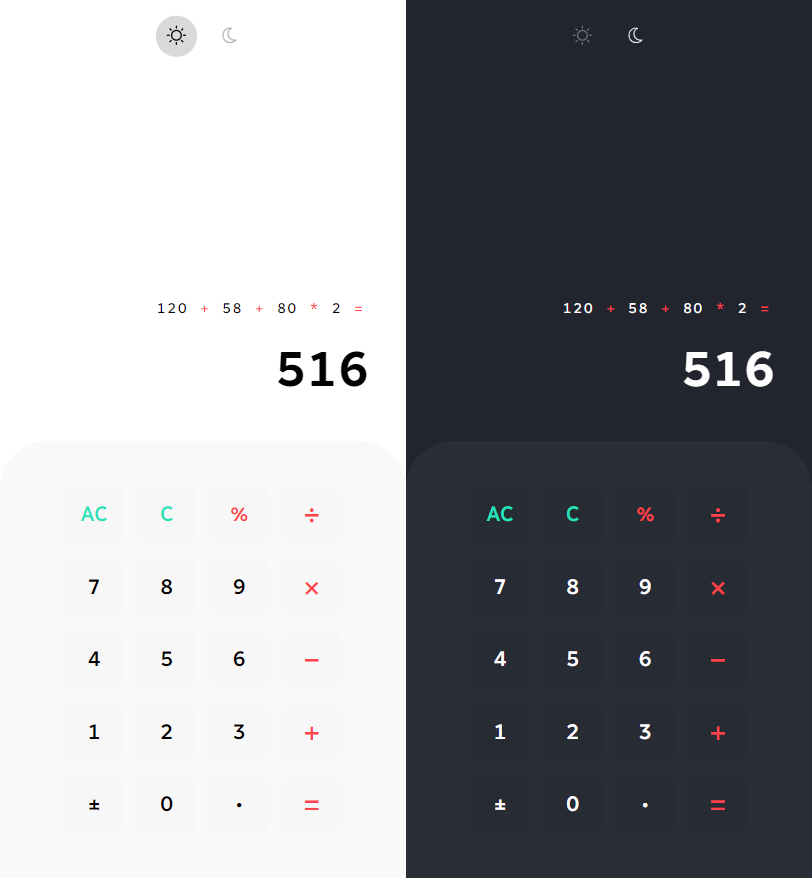

# Calculator

   [](LICENSE)



> The current repository is part of a personal project. The main goal is to solve all app ideas from [florinpop17/app-ideas](https://github.com/florinpop17/app-ideas) repo. If you like this repo and want to support this journey, be free to donate any value to BTC wallet `3DNssbspq7dURaVQH6yBoYwW3PhsNs8dnK` ❤.

This repo contains a challenge proposed by [florinpop17/app-ideas](https://github.com/florinpop17/app-ideas). The goal of the calculator app is to do some basic arithmetics operations. See all challenge details [here](https://github.com/florinpop17/app-ideas/blob/master/Projects/1-Beginner/Calculator-App.md).

For this project the language chosen is React. Typescript also makes part of this project to keep classes, functions, and components typed and organized.

The app contains a keypad to user entries. Shows the current value at display, keep a history of all typed values and make possible to change theme color. The layout was inspired by [Lucia Scott's](https://dribbble.com/luciascott) Calculator on [Dribbble](https://dribbble.com/shots/14709020-Calculator).

## How to play with it?

1. Download or clone this repository by typing `git clone https://github.com/caiquearaujo/challenge-calculator-react` on your machine;
2. Navigate to the root folder, and type on terminal `npm install && npm run start`;
3. Server will run at `localhost:3000`.

## User Stories

- :white_check_mark: User can see a display showing the current number entered or the result of the last operation;
- :white_check_mark: User can see an entry pad containing buttons for the digits 0-9, operations - '+', '-', '/', and '=', a 'C' button (for clear), and an 'AC' button (for clear all);
- :white_check_mark: User can enter numbers as sequences up to 8 digits long by clicking on digits in the entry pad. Entry of any digits more than 8 will be ignored;
- :white_check_mark: User can click on an operation button to display the result of that operation on:
  - the result of the preceding operation and the last number entered OR;
  - the last two numbers entered OR;
  - the last number entered.
- :white_check_mark: User can click the 'C' button to clear the last number or the last operation. If the users last entry was an operation the display will be updated to the value that preceded it;
  - **!!** I changed the behavior here to cleanup last number only.
- :white_check_mark: User can click the 'AC' button to clear all internal work areas and to set the display to 0;
- :white_check_mark: User can see 'ERR' displayed if any operation would exceed the 8 digit maximum.

### Bonus features

- :white_check_mark: User can click a '+/-' button to change the sign of the number that is currently displayed;
- :white_check_mark: User can see a decimal point ('.') button on the entry pad to that allows floating point numbers up to 3 places to be entered and operations to be carried out to the maximum number of decimal places entered for any one number;
- :white_check_mark: User can do a '%' operation;
- :white_check_mark: User can do operations by pressing keys;
- :white_check_mark: User can change the layout theme color;
- :white_check_mark: User can see the history with the last operations.

## Available Scripts

In the project directory, you can run:

### `npm start`

Runs the app in the development mode.\
Open [http://localhost:3000](http://localhost:3000) to view it in the browser.

The page will reload if you make edits.\
You will also see any lint errors in the console.

### `npm test`

Launches the test runner in the interactive watch mode.\
See the section about [running tests](https://facebook.github.io/create-react-app/docs/running-tests) for more information.

### `npm run build`

Builds the app for production to the `build` folder.\
It correctly bundles React in production mode and optimizes the build for the best performance.

The build is minified and the filenames include the hashes.\
Your app is ready to be deployed!

See the section about [deployment](https://facebook.github.io/create-react-app/docs/deployment) for more information.

### `npm run eject`

**Note: this is a one-way operation. Once you `eject`, you can’t go back!**

If you aren’t satisfied with the build tool and configuration choices, you can `eject` at any time. This command will remove the single build dependency from your project.

Instead, it will copy all the configuration files and the transitive dependencies (webpack, Babel, ESLint, etc) right into your project so you have full control over them. All of the commands except `eject` will still work, but they will point to the copied scripts so you can tweak them. At this point you’re on your own.

You don’t have to ever use `eject`. The curated feature set is suitable for small and middle deployments, and you shouldn’t feel obligated to use this feature. However we understand that this tool wouldn’t be useful if you couldn’t customize it when you are ready for it.

## Changelog

See the [CHANGELOG](CHANGELOG.md) file for information about all code changes.

## Testing the code

This library uses the **Jest**. We carry out tests of all the main features of this application.

```bash
npm run test
```

## Contributions

See the [CONTRIBUTING](CONTRIBUTING.md) file for information before submitting your contribution.

## Credits

- [Caique Araujo](https://github.com/caiquearaujo)
- [All contributors](../../contributors)

## License

MIT License (MIT). See [LICENSE](LICENSE).